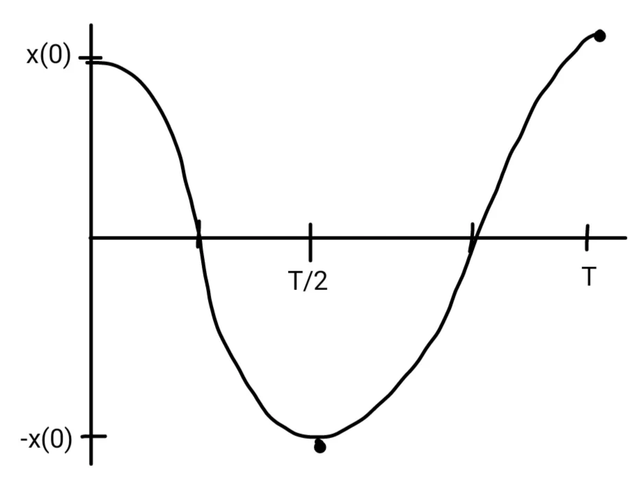

# Product, quotient, and chain rule

## Chain Rule

The chain rule is used to differentiate composite functions, when the "inside"
of the function is more complicated than what we know.

```{topic} Chain rule
If a function $f(x)$ can be written as $f(u(x))$, then:
\begin{equation}
f'(x) = \dd{}{f}{u} \dd{}{u}{x} = f'(u) u'(x)
\end{equation}
```

To demonstrate this rule, consider $f(x) = (x-1)^2$. Previously, we would have
needed to expand this function before differentiating:

\begin{align}
f(x) &= x^2 - 2x + 1 \\
f'(x) &= 2x - 2
\end{align}

With the chain rule, instead we recognize

\begin{align}
u &= x - 1  &  f &= u^2 \\
u' &= 1  &  f' &= 2u
\end{align}

so

\begin{equation}
f'(x) = \dd{}{f}{u} \dd{}{u}{x} = 2u \dd{}{u}{x} = 2(x-1) \cdot 1 = 2x - 2
\end{equation}

The results match! Some additional examples:

1. $f(x) = e^{x^2}$

   Make the replacement $u = x^2$:

   \begin{align}
   u &= x^2  &  f &= e^u \\
   u' &= 2x  &  f' &= e^u
   \end{align}

   so

   \begin{equation}
   f'(x) = \dd{}{f}{u} \dd{}{u}{x} = e^{u} \dd{}{u}{x} = e^{x^2} \cdot 2x
   \end{equation}

2. $f(x) = \ln(1 + 2x)$

   Make the replacement $u = 1+2x$:

   \begin{align}
   u &= 1 + 2x  & f &= \ln u \\
   u' &= 2  &  f' &= \frac{1}{u}
   \end{align}

   so

   \begin{equation}
   f'(x) = \dd{}{f}{u} \dd{}{u}{x} = \frac{1}{u} \dd{}{u}{x} = \frac{2}{1 + 2x}
   \end{equation}

3. $f(x) = \dfrac{2}{1 + 2x}$

   Make the replacement $u = 1+2x$:

   \begin{align}
   u &= 1 + 2x  & f &= 2u^{-1} \\
   u' &= 2  &  f' &= -2u^{-2}
   \end{align}

   so

   \begin{equation}
   f'(x) = \dd{}{f}{u} \dd{}{u}{x} = -2u^{-2} \cdot \dd{}{u}{x} =
     \frac{-4}{(1 + 2x)^2}
   \end{equation}

```{example} Harmonic oscillator


\begin{equation*}
F=-kx
\end{equation*}

\begin{equation*}
x(t)=x(0)\cos\left(\frac{2\pi t}{T}\right) 
\end{equation*}

\begin{equation*}
T = \frac{1}{2\pi} \sqrt{\frac{m}{k}}
\end{equation*}



How fast is the oscillator moving?

\begin{align*}
u &= \frac{2\pi t}{T} \\
f(u) &= x(0)\cos(u) \\
f'(u) &= -x(0)\sin(u) \\
u' &= \frac{2\pi}{T} \\
v(t) &= \frac{d}{dt}x(t) = f'(u) \cdot u' = -x(0)\sin\left(\frac{2\pi t}{T}\right) \cdot \frac{2\pi}{T}
\end{align*}

\begin{equation*}
v(t)=-\frac{2\pi x(0)}{T} \sin\left(\frac{2\pi t}{T}\right)
\end{equation*}

When is the oscillator moving *fastest*?

A function is at an *extrema* when its derivative is zero. If the function is velocity, this is
\begin{equation*}
a=v'=0
\end{equation*}
i.e., it's not accelerating!

\begin{align*}
a&=v'=-\left(\frac{2\pi}{T}\right)^2 x(0) \cos\left(\frac{2\pi t}{T}\right) = 0 \\
t&= {T/4} \text{or} {3T/4}
\end{align*}

This is when
\begin{equation*}
x(t)=0  
\end{equation*}
and the spring is not stretched!

Under these conditions, all of the potential energy is kinetic energy. 
```
