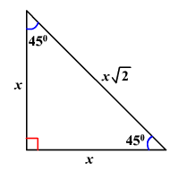

# Functions
### Evaluating and Manipulating Trigonometric Functions

\begin{align}
\sin(\theta)& = \frac{y}{r}& 
\cos(\theta)& = \frac{x}{r}& 
\tan(\theta)& = \frac{y}{x}\\

\csc(\theta)& = \frac{r}{y}&
\sec(\theta)& = \frac{r}{x}&
\cot(\theta)& = \frac{x}{y}\\
\end{align}

Angles can be measured in degrees of radians
\begin{align}
\theta(rad.)& = \theta(deg.)(\frac{\pi}{180^{\circ}})
\end{align}

Special Angles
\begin{align}
\theta& = 30^{\circ} \frac{\pi}{6}& \theta& = 60^{\circ} \frac{\pi}{3}
\end{align}

At $ \theta = 30^{\circ} $:
\begin{align}
\sin(\theta)& = \frac{1}{2}& 
\cos(\theta)& = \frac{\sqrt{3}}{2}
\end{align}

At $ \theta = 60^{\circ} $:
\begin{align}
\sin(\theta)& = \frac{\sqrt{3}}{2}&
\cos(\theta)& = \frac{1}{2}& 
\end{align}

At $ \theta = 45^{\circ} $
\begin{align}
\sin(\theta)& = \frac{1}{\sqrt{2}}&
\cos(\theta)& = \frac{1}{\sqrt{2}}
\end{align}

What about $ \theta' \ge 90^{\circ}(\frac{\pi}{2}) $?
Take the angle of $\theta$ relative to the x-axis, then apply the sign based on which quadrant the angle falls in.

Example: $\theta = 185^{\circ}$

The graph shows $\theta = frac{3\pi}{4}$ and $\theta' & = \frac{\pi}{4}$ 
\therefore
\begin{align}
\sin(\theta')& = \frac{1}{\sqrt{2}}&
\cos(\theta')& = \frac{1}{\sqrt{2}}
\end{align}

"s" is positive so:
\begin{align}
\sin(\theta)& = \frac{1}{\sqrt{2}}&
\cos(\theta)& = -\frac{1}{\sqrt{2}}
\end{align}

Trigonometric functions represent waves. The properties of the wave can be encoded by manipulating the function.

\begin{align}
y& = A\sin((\frac{2\pi}{L})(x + x_{o})) + y_{o}
\end{align}
Where: A = amplitude, $\frac{2\pi}{L}$ = period, $x + x_{0}$ = horizontal shift, and $y_{o}$ = vertical shift