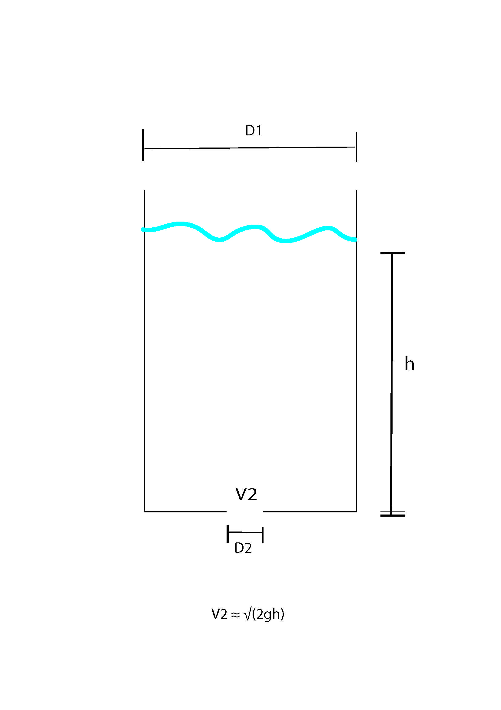

# Separable differential equations
### Example 1
The iceman Ötzi was found to have 52.5% of the C{sup}`14` of a living organism.  
If the half-life of the C{sup}`14`is 5715 years, how long ago did Ötzi die if C{sup}`14` disappears by the first-order reaction?

$$
\frac{dc}{dt} = -kc%
$$

Solution:
Assume at death t=0 and c(0) = c{sub}`0` 

$$
\int \frac{1}{c}\, dc = \int -k\, dt
$$
$$
\ln(c) = -kt + B
$$
$$
c = A e^{-kt}
$$
$$
c(0) = c_0 = A
$$
c(t) = c_0 e^{-kt}
$$

It is known that c(5715 year) = 0.5 c{sub}`0`  and t is needed where  c(t) = 0.525 c{sub}`0`  

Take the ratio of the two equations:
Equation 1 

$$ 
0.5 c_0 = c_0 e^{-k (5715 years)} 
$$

The initial c cancels out and we are left with:

$$
\ln(0.5) = -k (5715 years) 
$$

 Equation 2 : 

$$
0.525 c_0 = c_0 e^{-kt} 
$$

Initial c cancels out again

 $$
\ln(0.525) = - kt 
$$

Combine Equation 1 and 2

$$
\frac{t}{5715 year} = \frac{\ln(0.525)}{\ln(0.5)} 
$$
$$ 
t = (5715 year) (\frac{\ln(0.525)}{\ln(0.5)})
$$
$$ 
 t = 5310 years 
 $$
 
 **Final Answer**
 **Ötzi died approximately 5310 years ago**
### Example 2
 Newtons law of cooling 
Estimate the temperature in an office building at 6 a.m. if the heat goes off at 10 p.m. when the building is 70 degrees fahrenheit and the outside if 45 degrees fahrenheit.

$$ 
\frac{dT}{dt} = -k(T - T_{outside}) 
$$

If  k = 0.05 and T(10p.m.) = T(0) = 70

$$
\int \frac{1}{T - T_{outside}}\, dT = \int -k\, dt
$$
$$
ln(T - T_{outside}) = -kt + C 
$$
$$
T - T_{outside} = C e^{-kt}
$$
$$
T = T_{outside}+ C e^{-kt}
$$

Since T(10p.m.) = T(0) = 70 then 70 = 45 + C so C = 25

$$ 
T = 45 + 25 e^{-(0.05t)}
$$
$$ 
T(8) =  45 + 25 e^{-(0.05(8))}
$$
$$
45 + 25 e^{-(0.05(8))} = 62 
$$

**Final Answer** 
**The temperature at 6 a.m. is approximately 62°F**
### Example 3
Torcelli's Law 
A 1cm hole opens at the bottom of a 1m cylindrical tank. If there is 2m of water in the tank, when does it drain?

***
Solution:
Known equations:

$$
m = \rho V(t) 
$$

so,

$$
m = \rho (\frac{\pi (D_1)^2}{4}) h(t)
$$

Mass Balance:

$$
\frac{dm}{dt} = -m_{out} 
$$ 

also, 
Equation 1:

$$ 
\frac{dm}{dt} = \rho (\frac{\pi(D_2)^2}{4}) V_2 
$$

Equation 2

It is known that:

$$
V_2= \sqrt{2gh}
$$

Plug equation 3 into equation 2 and set equal to known equation

$$ 
\rho (\frac{\pi(D_2)^2}{4})\sqrt{2gh} = \rho (\frac{\pi (D_1)^2}{4})\frac{dh}{dt} 
$$

Simplify:

$$ 
\frac{dh}{dt} = -(\frac{D_2}{D_1})^2 \sqrt{2gh} 
$$

$$
\int \frac{1}{\sqrt{h}}\, dh = \int -(\frac{D_2}{D_1})^2 \sqrt{2gh}\,dt
$$

General Solution:

$$
2\sqrt{h} = -(\frac{D_2}{D_1})^2 \sqrt{2\cdot gh}\cdot t + C
$$

Find Integration Constant C 

$$
h(0) = h_0
$$ 

$$
2 \sqrt{h_0} = C 
$$

Plug back into General Solution
When the tank drains h=0 so, 

$$
\sqrt{h} = \sqrt{h_0} - 0.5(\frac{D_2}{D_1})^2\sqrt{2gh}(t) 
$$

$$
h =  (\sqrt{h_0} - 0.5(\frac{D_2}{D_1})^2 \sqrt{2gh}\cdot t)^2 
$$

When the tank drains h=0  so, 

$$
0 = \sqrt{h_0}- 0.5(\frac{D_2}{D_1})^2 \sqrt{2gh}\cdot t
$$

Plug in known values 

$$ 
t = 2(\frac{D_2}{D_1})^2 \sqrt{\frac{h_0}{2g}} 
$$
$$ 
t = 2(\frac{1}{0.01})^2 \sqrt{\frac{2}{2 \cdot 9.81}} 
$$

**Final Answer**
The tank is empty after 1.8 hours
**The tank is empty after 1.8 hours**