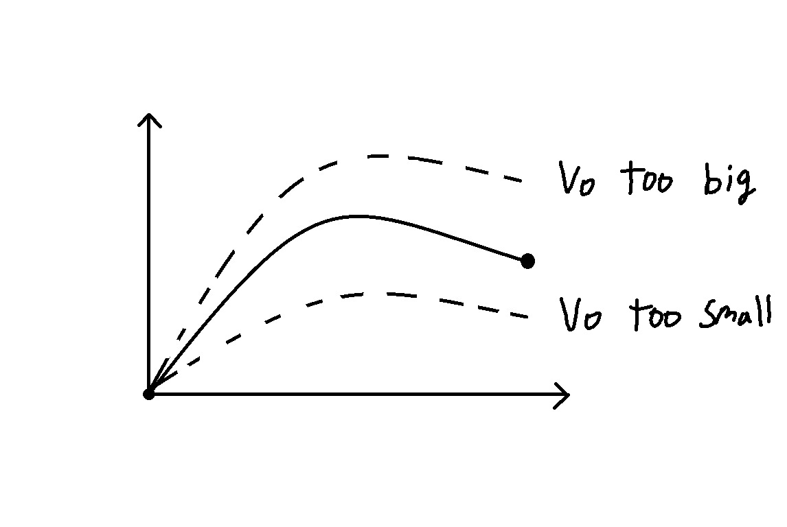

# Numerical solution methods
## Boundary value problems : shooting method

 We can solve *initial* value problems for second-order ODEs by converting to a system and using methods we know. What about BVPs?

Let's say we want to solve&nbsp; $y''+y=0$ &nbsp; $y(0)=0$ &nbsp; $y(\frac{\pi}{6})=4$
    using normal approch:
   
$$
\text{$y=8sinx$} \quad
\left\{
\begin{array}{l}
y=c_1cosx+c_2sinx\\
0=y(0)=c_1\\
4=y(\frac{\pi}{6})=c_2(\frac{1}{2})\rightarrow c_2=8
\end{array}
\right.
$$

 what if we needed to do this numerically? Try converting to system.

$$
\left\{
\begin{aligned}
y_1' &= y_2 \\
y_2' &= -y_1
\end{aligned}
\right.
\quad
\begin{aligned}
y_1(0) &= 0 \\
y_2(0) &= a  \leftarrow {\footnotesize unknown}
\end{aligned}
\quad \Rightarrow \quad
\mathbf{y}' =
\begin{bmatrix}
0 & 1 \\
-1 & 0
\end{bmatrix}
\mathbf{y}, \quad
\mathbf{y}(0) =
\begin{bmatrix}
0 \\
a
\end{bmatrix}
$$

$$
\text{Figure this out so that } y_1\left( \frac{\pi}{2} \right) = 4
$$
-----++
Let's say we want to solve:  

\begin{equation}  
y'' + y = 0, \quad y(0) = 0, \quad y(\frac{\pi}{6}) = 4  
\end{equation}  

Using normal approach:  

\begin{align}  
y &= c_1 \cos x + c_2 \sin x \\  
0 &= y(0) = c_1 \\  
4 &= y(\frac{\pi}{6}) = c_2 \frac{1}{2} \\  
c_2 &= 8  
\end{align}  

so,  

\begin{equation}  
y = 8 \sin x  
\end{equation}  

What if we needed to do this numerically? Try converting to system:  

\begin{equation}  
y_1 = y \quad y_2 = y' \quad y'' = -y  
\end{equation}  

Then, 

\begin{align}  
y_1' &= y_2 & y_1(0) &= 0 \\  
y_2' &= -y_1 & y_2(0) &= a  
\end{align}  

where *a* is unknown value that we need to figure out so $y(\frac{\pi}{6}) = 4$. We can write:  

\begin{equation}  
\vv{y}' = \begin{bmatrix} 0 & 1 \\ -1 & 0 \end{bmatrix} \vv{y}, 
\quad \vv{y}(0) = \begin{bmatrix} 0 \\ a \end{bmatrix}  
\end{equation}  

------++
How do we do this when we have only numbers? <u>Shooting method.</u>

- Formuate system of ODEs with () <u>initial</u> condtion is know

- Use a root finding method to solve for <u>unknown</u> initial condition in order to satisify remaining boundary condtion.

    → Bisection is good choice here!

5. Example : Reaction-diffusion with <u>second order</u> reaction

$$
D\frac{d^2c}{dx^2}-kc^2=0 \quad \quad C(0)=C_0\quad\quad -DC'(L)=0
$$
formulate&nbsp; &nbsp; &nbsp; $y'=C$ &nbsp; &nbsp; &nbsp; $y_2=C_2$ &nbsp; &nbsp; &nbsp; $C''=\frac{K}{D}C^2$

$$
\left\{
\begin{array}{l}
y_1'=y_2\quad\quad\quad\quad y_1(0)=C_0\\
y_2'=\frac{K}{D}y_1'\quad\quad\quad y_2(0)=a
\end{array}
\right.
$$

$$
\left\{

y_1'=y_2\quad\quad\quad\quad y_1(0)=C_0\\
y_2'=\frac{K}{D}y_1'\quad\quad\quad y_2(0)=a

\right.
$$
vary a and solve numerically for $\underline{y}(L)$ until $y_2(L)=0$!